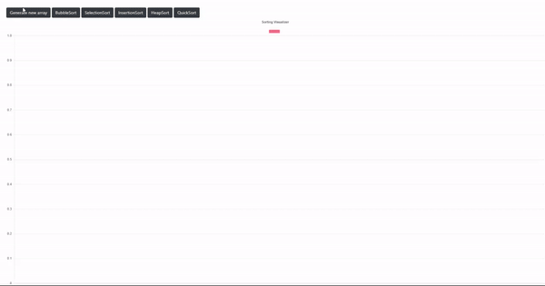

## SortingVisualizer
Visualizes some of the sorting algorithms that were taught during the IN2010 Algorithms and Data Structures course at UiO.

### Demo:
- [Demo](https://lukamomc.github.io/SortingVisualizer)

### Sorting algorithms:
- Bubble Sort
- Selection Sort
- Insertion Sort
- Quick Sort
- HeapSort
